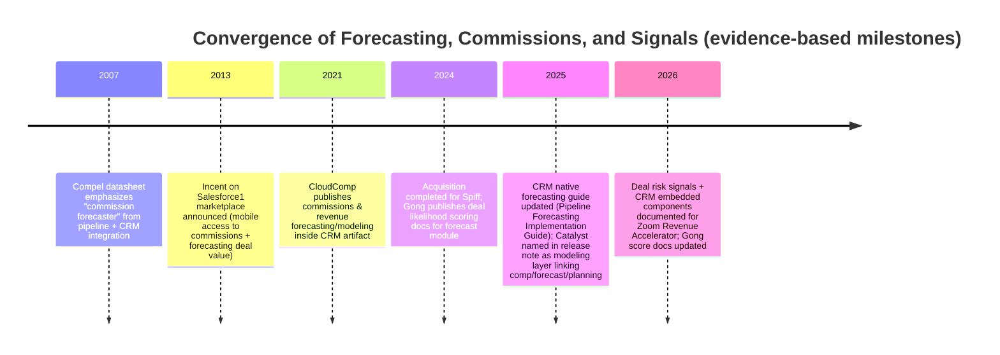

# Revenue Execution Market Scan for a Unified Forecast–Commissions–Signals Product

## Executive summary

No single, widely-documented commercial product cleanly ships **all four** of your proposed pillars—**hierarchical forecast governance** (explicit submit/freeze + override chain), **commission calculation + rep-visible earnings**, **deal health signals** (AI scores/risk signals), and **revenue-behavior intelligence** that explicitly links comp plan mechanics to forecast distortion—**as one cohesive “revenue execution layer”** with an auditably-governed workflow. Instead, the market largely splits into (a) forecasting/revenue platforms that emphasize rollups, deal inspection, and AI scoring, and (b) incentive compensation / sales performance management platforms that emphasize calculation, rep statements, tracing/audit, and payout workflows. citeturn28view0turn8view0turn38view1turn11view0

The _closest_ convergence shows up in a sales performance suite that explicitly markets **commission impacts combined with pipeline data** and **forecasting commissions alongside pipeline movement**, plus **deal-level health/confidence scoring** and sentiment/activity signals. citeturn3view0turn34view0turn33view0 However, the public documentation reviewed here does **not** clearly evidence an end-to-end, explicit **hierarchical “submit → manager override → executive freeze” governance lifecycle** as a first-class workflow in that same bundle (as opposed to multi-level views/scoring and rollups). citeturn33view0turn28view0turn26view0

## Scope and evaluation criteria

This research tests whether a **single commercial product** already unifies:

- **Forecast governance:** hierarchical overrides plus an explicit submission/freeze cadence (rep → manager → leader) and auditability.
- **Commissions:** robust calculation + rep statements/visibility + estimator/what-if capability.
- **Signals:** deal health/risk scores driven by CRM + activity/conversation signals (emails/calls/meetings).
- **Behavior intelligence:** linking comp-plan structure (accelerators, tiers, etc.) to forecast behavior (e.g., sandbagging/optimism) in a way that is actionable and explainable.

Priority sources were official product pages, vendor documentation, press releases, and marketplace artifacts (where accessible). In multiple cases, **Salesforce AppExchange listing pages were not machine-readable in this environment**, so AppExchange-adjacent PDFs and vendor documentation were used as substitutes and marked accordingly. citeturn22view0turn24view0turn37view1

## Competitive landscape and evidence

### Competitor table

Legend for key feature columns:

- ✅ = clearly evidenced in sources
- ⚠️ = partial/adjacent (capability implied or exists but not as a unified workflow)
- ❌ = not evidenced / out of scope for that product
- unspecified = not found in reviewed sources

| ID  | Company                                                          | Product(s) evaluated                                                                   | Primary sources                                                                                                                                                                                                                   | Launch / notable milestone                                                                                      | CRM-native vs standalone                                                                                                                     | Forecast governance (submit/freeze + hierarchical overrides)                                                                                                                                | Commissions (calc + rep visibility + estimator)                                                                                                                                                           | Deal health signals (score/risk signals)                                                                                                    | Comp→forecast behavior layer                                                                                                                                              | Explainability / audit posture                                                                                                                                                                                                  | Integrations (CRM / CI / chat)                                                                                                                 | Pricing model                                                                                                       | ICP / verticals                                                                                               | Funding / status                                                                                               | Differentiation notes vs the proposed “RevenueTrust” wedge                                                                                                                                  |
| --- | ---------------------------------------------------------------- | -------------------------------------------------------------------------------------- | --------------------------------------------------------------------------------------------------------------------------------------------------------------------------------------------------------------------------------- | --------------------------------------------------------------------------------------------------------------- | -------------------------------------------------------------------------------------------------------------------------------------------- | ------------------------------------------------------------------------------------------------------------------------------------------------------------------------------------------- | --------------------------------------------------------------------------------------------------------------------------------------------------------------------------------------------------------- | ------------------------------------------------------------------------------------------------------------------------------------------- | ------------------------------------------------------------------------------------------------------------------------------------------------------------------------- | ------------------------------------------------------------------------------------------------------------------------------------------------------------------------------------------------------------------------------- | ---------------------------------------------------------------------------------------------------------------------------------------------- | ------------------------------------------------------------------------------------------------------------------- | ------------------------------------------------------------------------------------------------------------- | -------------------------------------------------------------------------------------------------------------- | ------------------------------------------------------------------------------------------------------------------------------------------------------------------------------------------- |
| C1  | entity["company","Xactly","sales performance software"]       | Forecast + Commission Earnings Forecasting + CRM-native incentives layer               | Forecast page and add-ons. citeturn3view0 Commission + pipeline “forecast commissions alongside pipeline movement” brochure. citeturn34view0 CRM-native comp layer page. citeturn5view0                                  | Incent on mobile CRM marketplace announced around Dreamforce-era (2013/2014 press artifact). citeturn30view0 | **Hybrid**: forecasting appears SaaS; comp has a “native in CRM” product line. citeturn3view0turn5view0                                  | ⚠️ **Multi-level forecasts** and hierarchy-level accuracy are claimed, but explicit submit/freeze workflow is not clearly evidenced. citeturn33view0turn3view0                          | ✅ Strong: commissions visibility + incentive plan management; CRM-embedded comp workflows; “commission estimation” appears in platform narrative. citeturn5view0turn30view0                          | ✅ Health/confidence scoring, sentiment/activity signals, “health score” framing. citeturn3view0turn33view0                             | ✅ Explicit: “integrating incentive compensation data into the forecast” and combining commissions with pipeline to improve plans/behavior. citeturn3view0turn34view0 | ✅/⚠️ Claims “ML capabilities that explain in detail why an opportunity will win” and provides health score explanations; deeper causal transparency (comp-distortion) not explicitly documented. citeturn33view0turn3view0 | CRM ✅; CI ⚠️ (signals from calls/emails noted, but specific CI vendor hooks not proven here); chat unspecified. citeturn3view0turn33view0 | Custom / “request quote” implied. citeturn3view0                                                                 | CRO/CSO, RevOps/Sales Ops, Finance are explicitly called out. citeturn3view0                               | Private equity ownership noted in company materials (2017 acquisition). citeturn31search9                   | Closest “bundle competitor” on comp↔forecast. Your wedge remains stronger if you make governance + explainability first-class inside the CRM (not just rollups/scoring).                    |
| C2  | entity["company","CaptivateIQ","sales commission software"]   | Catalyst (predictive modeling) + Planning + Incentives ecosystem                       | Catalyst product page. citeturn9view0 “Meet Catalyst” release note (Sep 2025). citeturn10view0 Funding announcement (Series C). citeturn31search23                                                                       | Catalyst named/positioned in Sep 2025 release note. citeturn10view0                                          | Standalone SaaS (models across CRM/ERP/HRIS). citeturn9view0                                                                              | ⚠️ Strong planning workflows (approvals/routing) but not a deal-level hierarchical forecast submission/freeze construct in sources. citeturn9view0                                       | ✅/⚠️ Core value is incentive comp + planning; Catalyst forecasts attainment/payout and models scenarios, but deal-level commission estimator in-CRM is not evidenced here. citeturn9view0turn10view0 | ⚠️ Account scoring is explicit; “pipeline” appears as an input, but not positioned as a frontline deal inspection system. citeturn9view0 | ⚠️ Links planning + comp + predictive insights, but a comp-plan distortion → forecast governance loop is not explicit. citeturn9view0turn10view0                      | ⚠️ “AI trained on your data” and ML predictions are described; transparency is not detailed as per-signal explainability in sources. citeturn9view0                                                                          | CRM ✅ (connects across systems); CI unspecified; chat unspecified. citeturn9view0                                                          | Pricing page exists but specific tiers not captured in sources here; treat as custom/unspecified. citeturn9view0 | Target users explicitly include RevOps/Sales Ops, comp, finance; several industries listed. citeturn9view0 | Raised $100M Series C (Jan 2022) with $1.25B post-money valuation stated by the company. citeturn31search23 | Strong “planning-to-payout” competitor, but less direct on frontline hierarchical forecast governance and on behavior intelligence tied to forecast distortion.                             |
| C3  | entity["company","Varicent","sales performance management"]   | Incentives + Sales Planning + Seller Insights                                          | Incentives product page (audit trail, dashboards, plan simulation). citeturn11view0 Seller Insights product page. citeturn13view0 Relaunch as independent company (Jan 2020). citeturn31search6                          | Independent relaunch effective Jan 2020. citeturn31search6                                                   | Standalone SaaS                                                                                                                              | ❌ Not evidenced as a hierarchical deal-level submit/freeze forecasting workflow; “forecast outcomes” appears more as plan simulation/analytics. citeturn11view0                         | ✅ Commission calculation automation + “full audit trail behind every calculation” phrasing. citeturn11view0                                                                                           | ❌/⚠️ “pipeline performance” appears as visibility context, but not as deal health scoring system in reviewed pages. citeturn11view0     | ⚠️ Strong incentives-to-behavior framing, but not explicit comp-driven forecast distortion loop. citeturn11view0turn13view0                                           | ✅ Strong auditability for comp calculations; “Research Assistant” positioned as plan-aware, not “black box.” citeturn11view0turn13view0                                                                                    | CRM unspecified; CI unspecified; chat unspecified.                                                                                             | Custom/demo-led. citeturn11view0                                                                                 | Industries and roles listed (e.g., finance/sales/HR). citeturn11view0                                      | Formerly IBM SPM assets; independent via private equity per company announcement. citeturn31search6         | Strong comp + planning incumbent; your wedge can win by living in the CRM and tying comp mechanics directly to forecast governance actions.                                                 |
| C4  | entity["company","Anaplan","connected planning software"]     | Revenue performance management (sales incentives + sales forecasting + GTM planning)   | Revenue performance management solution page. citeturn14view0                                                                                                                                                                  | unspecified                                                                                                     | Standalone SaaS                                                                                                                              | ⚠️ “Unify … workflows, and forecasting in one place” is explicit, but this is not documented as CRM-native deal-level governance with submit/freeze. citeturn14view0                     | ✅ Sales incentives at scale are explicit. citeturn14view0                                                                                                                                             | ⚠️ Mentions “buying signals” and scenario planning; not positioned as signal-driven deal health inside CRM. citeturn14view0              | ❌/⚠️ Incentives drive behaviors is implied; comp→forecast distortion loop is not explicit. citeturn14view0                                                            | ⚠️ AI agents are referenced, but explainability specifics are not captured here. citeturn14view0                                                                                                                             | CRM unspecified; CI unspecified; chat unspecified.                                                                                             | Enterprise/custom.                                                                                                  | Large-enterprise GTM planning, quotas, incentives, forecasting. citeturn14view0                            | Take-private status not researched here; treat as unspecified.                                                 | Strong planning backbone; not a “lightweight in-CRM revenue execution layer.”                                                                                                               |
| C5  | entity["company","Spiff","incentive compensation management"] | Incentive compensation management add-on (commission visibility + estimator + tracing) | Product page (rep statements, tracing, estimator, automation). citeturn8view0 Pricing page ($75 user/month billed annually; connector add-ons). citeturn6view0 Acquisition completion note (Feb 2024). citeturn31search0 | Became part of the CRM vendor portfolio in Feb 2024 (acquisition completed). citeturn31search0               | **CRM-ecosystem first-party** (positioned as integrated into the CRM ecosystem; described as “directly within [the CRM]”). citeturn8view0 | ❌ Forecast governance not present (though “forecast pacing” appears as a manager metric, not governance workflow). citeturn8view0                                                       | ✅ Strong: rep statements, tracing, estimator, automation at scale. citeturn8view0turn6view0                                                                                                          | ❌ Not a deal health engine.                                                                                                                | ❌ Does not claim comp-driven forecast distortion analytics.                                                                                                              | ✅ Audit trail for commissions and tracing is explicit. citeturn8view0                                                                                                                                                       | CRM ✅; CI unspecified; chat unspecified.                                                                                                      | **$75/user/month** (annual contract). citeturn6view0turn8view0                                                  | Sales leaders + finance + ops personas. citeturn8view0                                                     | Acquired Feb 2024. citeturn31search0                                                                        | Major “commission trust” incumbent inside the CRM ecosystem; your differentiation must be forecast governance + behavior intelligence, not commissions alone.                               |
| C6  | entity["company","Clari","revenue platform"]                  | Forecasting + revenue insights + deal inspection                                       | Forecast product page. citeturn36view0 Forecast governance feature checklist (overrides/notes, opportunity-level overrides). citeturn28view0 Integrations page (shows broad CRM/engagement stack logos). citeturn27view0 | Publication dates exist for content; product launch year unspecified. citeturn28view0turn36view0            | Standalone SaaS                                                                                                                              | ✅ Forecast submission + overrides + notes are explicitly called “must-have” features; product markets “automated roll-ups” and top-line-to-deal drill-down. citeturn28view0turn36view0 | ❌ No commission calculation/rep earnings engine evidenced.                                                                                                                                               | ✅ AI opportunity scores / deal inspection are core to positioning. citeturn28view0turn36view0                                          | ❌ Comp→forecast behavior intelligence not evidenced.                                                                                                                     | ⚠️ AI-driven insights; explainability level not clearly specified in sources reviewed. citeturn36view0turn28view0                                                                                                           | CRM ✅; CI ✅/⚠️ (integrations page shows CI/engagement logos); chat ✅/⚠️ (collaboration logos shown). citeturn27view0                     | Custom/demo-led. citeturn36view0                                                                                 | RevOps + forecast-owning leadership. citeturn36view0turn28view0                                           | Funding/status not researched here; unspecified.                                                               | Best-in-class forecasting governance + AI deal inspection, but missing commissions and explicit comp-driven behavior analytics.                                                             |
| C7  | entity["company","Gong","revenue intelligence platform"]      | Forecast (deal likelihood scoring) + signals                                           | Deal likelihood scores documentation (signals from CRM/calls/emails; positive/negative signals shown). citeturn38view1 Slack integration documentation. citeturn38view0                                                     | Deal likelihood scoring docs published Apr 2024; updated Feb 2026. citeturn38view1                           | Standalone SaaS                                                                                                                              | ⚠️ Forecast module exists, but “submit/freeze governance” is not evidenced in reviewed docs. citeturn38view1turn38view2                                                                 | ❌ No commission calculation/rep earnings.                                                                                                                                                                | ✅ Strong: ML model uses “300+ signals,” and scores list weighted positive/negative signals. citeturn38view1turn38view2                 | ❌ No comp→forecast behavior layer.                                                                                                                                       | ✅ Explicit per-score signal listing and daily scoring cadence; strong “why” posture for scores. citeturn38view1                                                                                                             | CRM ✅ (supported CRM integrations listed); chat ✅ (Slack integration docs). citeturn38view1turn38view0                                   | Pricing unspecified in sources reviewed.                                                                            | Sales reps/managers explicitly targeted for forecast/score feature. citeturn38view1                        | Funding/status not researched here; unspecified.                                                               | Strong “signals and scoring” competitor; your wedge is the commission-aware governance loop rather than scoring alone.                                                                      |
| C8  | entity["company","Zoom","video communications and rev accel"] | Revenue Accelerator (deal risk signals + CRM LWC integration + chat integration)       | Deal risk signals doc. citeturn37view0 CRM integration/config guide (Lightning Web Component). citeturn37view1 Chat integration feature page. citeturn37view2                                                            | Roadmap/feature dates not specified in sources reviewed; treat as unspecified.                                  | Standalone SaaS with CRM embedded components. citeturn37view1                                                                             | ❌ Not a forecast governance product.                                                                                                                                                       | ❌ No commission engine.                                                                                                                                                                                  | ✅ Deal risk signals are explicit (e.g., lack of engagement, missing keywords). citeturn37view0                                          | ❌ No comp→forecast behavior layer.                                                                                                                                       | ⚠️ Risk signal criteria and subscriptions exist; explainability depth is limited to signal types. citeturn37view0                                                                                                            | CRM ✅ (Lightning config); chat ✅ (integration page). citeturn37view1turn37view2                                                          | Paid add-on pricing model implied. citeturn37view2                                                               | Sales managers/revenue leaders (implied by positioning). citeturn37view2turn37view0                       | Status/funding irrelevant (public company).                                                                    | Great adjacent “signal” component; not a competitor for commissions or hierarchical forecast governance.                                                                                    |
| C9  | entity["company","Surfwriter","sales compensation on crm"]    | CloudComp (CRM-native commission modeling + commissions/revenue forecasting & what-if) | “Forecasting and Modeling” PDF (2021) + screenshot. citeturn20view0turn22view0                                                                                                                                                | Copyright 2021 on artifact. citeturn22view0                                                                  | CRM-native (per positioning in AppExchange artifacts; listing page not readable here). citeturn20view0turn22view0                        | ❌ This is not pipeline forecast governance; it is commissions/revenue forecasting & modeling. citeturn20view0turn22view0                                                               | ✅ Strong modeling for commissions and revenue margin what-if. citeturn22view0                                                                                                                         | ❌ No deal health signals.                                                                                                                  | ⚠️ “What-if” for comp expense and revenue exists; comp→forecast distortion behavior analytics not evidenced. citeturn20view0turn22view0                               | ✅ Deterministic scenario modeling; transparency is inherent (inputs/tiers editable). citeturn22view0                                                                                                                        | CRM ✅; CI/chat unspecified.                                                                                                                   | Pricing unspecified.                                                                                                | Sales + finance collaboration on commissions/revenue forecasts is explicit. citeturn20view0                | Status unspecified.                                                                                            | This is the clearest example of “commission forecasting inside CRM,” but it does not unify forecast governance or deal signals.                                                             |
| C10 | entity["company","Centive","sales compensation vendor"]       | Compel (legacy CRM-integrated commission forecasting on pipeline opportunities)        | AppExchange-era datasheet screenshot (lists projected commission forecaster, audit trail; $50/user/month list price). citeturn24view0                                                                                          | Legacy artifact implies mid/late-2000s era. citeturn24view0                                                  | CRM-integrated (legacy composite). citeturn24view0                                                                                        | ❌ Does not describe hierarchical forecast governance; focuses on forecasting commission earnings from pipeline filters. citeturn24view0                                                 | ✅ Commission calc + commission forecasting. citeturn24view0                                                                                                                                           | ❌ No deal health signals.                                                                                                                  | ⚠️ Early “pipeline→commission forecast” linkage; not comp→forecast distortion governance. citeturn24view0                                                              | ✅ Audit trail and process controls are stressed. citeturn24view0                                                                                                                                                            | Integrations unspecified beyond CRM tie-in.                                                                                                    | $50/user/month listed (legacy). citeturn24view0                                                                  | Role-based dashboards for reps/managers/executives listed. citeturn24view0                                 | Status likely defunct/absorbed; unspecified.                                                                   | Proof that “pipeline ↔ commissions” is not a brand-new idea, but modern products still rarely add explicit hierarchical forecast governance + signals + behavior intelligence as one layer. |
| C11 | entity["company","QuotaPath","commission tracking software"]  | Salesforce integration (deal commissions + forecast earnings)                          | Integration page (pull deal data, forecast earnings; “display earnings in Salesforce”). citeturn29view0                                                                                                                        | unspecified                                                                                                     | Standalone SaaS with CRM integration                                                                                                         | ❌ No hierarchical forecast governance. citeturn29view0                                                                                                                                  | ✅ Commission automation + earnings visibility; “forecast earnings” explicit. citeturn29view0                                                                                                          | ❌ No deal health scoring engine.                                                                                                           | ❌ No comp→forecast distortion analytics.                                                                                                                                 | ⚠️ Transparency around earnings; audit depth unspecified. citeturn29view0                                                                                                                                                    | CRM ✅; CI/chat unspecified.                                                                                                                   | Pricing not captured here; unspecified.                                                                             | RevOps + finance + sales reps (implied). citeturn29view0                                                   | Status/funding unspecified.                                                                                    | Mid-market commissions+earnings competitor; does not unify forecast governance or signals.                                                                                                  |

image_group{"layout":"carousel","aspect_ratio":"16:9","query":["Xactly forecasting health score screenshot","Salesforce Spiff commission estimator rep statement screenshot","Clari Forecast product screenshot forecast rollup","Gong deal likelihood score screenshot"],"num_per_query":1}

### Mermaid timeline of notable launches and convergence points

The timeline below uses the earliest **explicit artifacts** found in sources (not necessarily true product inception). citeturn24view0turn30view0turn22view0turn31search0turn10view0turn38view1turn26view0



## Gap analysis and market saturation assessment

### What is already “saturated” vs what appears underbuilt

Forecasting platforms are strong on **rollups, drill-down to deals, and AI risk/score narratives**, including explicit “forecast submission … overrides, and notes” and “opportunity-level overrides” as forecast-solution requirements. citeturn28view0turn36view0turn38view1 Commission platforms are strong on **rep statements, tracing/audit, dispute workflows, and estimators**, including “commission tracing functionality” and “commission estimator” positioning. citeturn8view0turn6view0 Signal engines are strong on **activity/conversation-driven risk signals**, such as deal risk signals for engagement/keywords and ML-driven deal likelihood scores. citeturn37view0turn38view1turn3view0

What is materially less common (and is your likely wedge) is **closing the loop** between these categories:

1. **Governance loop:** a formal, auditable _forecast governance state machine_ (submit/approve/freeze) that is not merely “rollups and scoring,” but an explicit process that operations can enforce. The built-in CRM forecasting guide shows hierarchical adjustments exist in core forecasting, but it is primarily a forecasting feature set—not inherently tied to commissions or behavior analytics. citeturn26view0
2. **Behavior loop:** an explicit system that uses **comp plan economics** to predict and explain **forecast behavior** (e.g., how accelerators/tier thresholds motivate pull-in/push-out) _and then_ surfaces governance actions (override recommendations, required notes, risk flags). A suite competitor clearly markets comp data integrated into forecasting and commissions forecasted alongside pipeline movement, but public documentation still reads more like **“combine datasets for better forecasting”** than **“govern and correct incentive-driven distortion.”** citeturn3view0turn34view0turn33view0
3. **Explainability at decision time:** Several products claim AI scoring; one scores deals and lists signals, which is good explainability for _scores_. citeturn38view1 Very few sources describe explainability that is **comp-plan-aware** (e.g., “this forecast change is likely driven by accelerator crossing; here is the payout delta that correlates with a category change”), especially embedded into a hierarchical governance workflow.

### Feature-by-feature gap map

Below, “unaddressed” means **not evidenced as a unified, productized workflow** in the reviewed sources (not that it is impossible via services/custom work).

- **Hierarchical forecast submission + freeze as a first-class workflow:** Mostly addressed by forecasting-centric platforms (C6) and by base CRM forecasting features—but **not** as part of a commissions+signals+behavior layer. citeturn28view0turn26view0
- **CRM-native commission transparency + estimator inside opportunity workflow:** Strongest in CRM-ecosystem commission add-ons (C5) and CRM-native comp layers (C1/C9), but these typically **do not** ship forecast governance. citeturn8view0turn5view0turn22view0
- **Deal health signals wired into forecast actions:** Strongly present in signal engines (C7/C8) and forecast platforms (C6/C1), but these generally **do not** compute commissions. citeturn38view1turn37view0turn36view0
- **Comp-plan distortion intelligence tied to forecast governance:** Only partially suggested in the suite competitor’s public marketing (“commission impacts and pipeline data” and integrating incentive comp into forecasting). citeturn3view0turn34view0 None of the reviewed sources document a full “distortion detection → governance intervention → plan iteration feedback” loop as a packaged capability.

## Recommended positioning for RevenueTrust

### Positioning statement

**RevenueTrust** can position as the **CRM-native Revenue Execution Layer** that unifies **forecast governance + commission visibility + signals + behavior intelligence** _inside the workflow where forecast decisions are made_—not as a separate analytics layer that teams check after the fact.

A crisp mental model for buyers who already own “a forecasting tool” and “a commissions tool”:

- Forecasting tools answer: **“What will happen?”** (rollups, projections, scorecards). citeturn36view0turn28view0turn38view1
- Commission tools answer: **“What will we pay, and what will reps earn?”** (statements, tracing, estimators). citeturn8view0
- RevenueTrust answers: **“What will reps do because of how they’re paid, and how should governance respond?”** (distortion-aware governance).

### Three concrete differentiators to own

A “me-too” bundle is easiest to copy; the following are harder to copy because they require **domain-specific logic + governance UX**.

**Differentiator: Comp-aware forecast governance (not just comp-aware forecasts)**  
Ship a governance workflow where approvals/overrides/freeze are **conditioned on compensation exposure** (e.g., “rep moved deal to Commit within the last X days while estimated payout jumps Y%; require manager justification and attach trace”). Existing vendors largely market “combine incentive data with forecast” rather than explicit governance enforcement triggered by incentive economics. citeturn3view0turn34view0turn8view0

**Differentiator: Explainable revenue-behavior intelligence**  
Move past generic “AI says this is risky” by emitting **a structured, human-auditable explanation** that links:  
(1) payout delta, (2) plan mechanics (tier/accelerator/SPIF), (3) observed forecast adjustments, and (4) recommended governance action. The closest public explainability posture found is per-score positive/negative signals (useful), but it is **not** comp-plan-aware by default. citeturn38view1turn8view0

**Differentiator: “One-screen” manager calibration that joins forecast + earnings + signals**  
Managers today bounce between forecast rollups, scoreboards, and commission dashboards. Your unique screen can be: **forecast rollup + deal list + per-deal commission estimator + signal trail + override audit** with a “calibration mode.” Public sources show each component separately; the underbuilt area is their _manager decision cockpit_ as one workflow. citeturn36view0turn8view0turn38view1turn26view0

### Buyer decision flowchart for adopting a new revenue execution layer

```mermaid
flowchart TD
  A[Problem:\nForecast misses + commission disputes + noisy deal signals] --> B{Do we already own\nforecasting + commissions tools?}
  B -->|No| C[Buy best-of-breed\nforecasting and/or commissions]
  B -->|Yes| D{Is the pain\n"data visibility"\nor "governance + behavior"?}
  D -->|Visibility| E[Add/expand scoring & inspection\n(signals, AI, dashboards)]
  D -->|Governance + behavior| F[Evaluate revenue execution layer\nthat enforces workflow]
  F --> G{Can it live in the CRM\nwith auditability?}
  G -->|No| H[Reject or require heavy services]
  G -->|Yes| I[Pilot with 1 region/segment\nmeasure forecast cycle time,\ndisputes, variance]
  I --> J{ROI proven?}
  J -->|No| K[Iterate model + workflow\nor stop]
  J -->|Yes| L[Roll out:\nforecast governance standard\n+ comp-aware calibration]
```

## Suggested design partners and discovery questions

### Criteria for design partners

Design partners should have (a) multi-level forecast calls, (b) meaningful variable comp plans, and (c) enough deal volume that governance and behavior effects show up in data within 1–2 quarters.

### Ten target design partners

These are **evidence-based candidates** drawn from public customer references and vendor materials reviewed above (not endorsements). Each is “worth a conversation” because they publicly appear in contexts tied to forecasting, commissions, or revenue tooling. citeturn3view0turn5view0turn11view0turn9view0turn36view0turn35search21

| Target company                                                      | Why it matches design-partner criteria (signals from public sources)                                                                                     |
| ------------------------------------------------------------------- | -------------------------------------------------------------------------------------------------------------------------------------------------------- |
| entity["company","Planmeca","dental equipment company"]          | Appears in a CRM-native incentives/collaboration case study context, suggesting incentive tooling maturity and CRM-embedded workflows. citeturn5view0 |
| entity["company","MetaCompliance","compliance software company"] | Referenced in forecasting collateral (forecast accuracy narrative), implying active forecasting programs and measurable outcomes. citeturn34view0     |
| entity["company","SentinelOne","cybersecurity company"]          | Highlighted in forecasting outcomes narrative, implying forecast discipline and potential appetite for governance improvements. citeturn36view0       |
| entity["company","Databricks","data platform company"]           | Used as an example of reducing revenue leak in forecasting context—likely to value execution + governance loops. citeturn36view0                      |
| entity["company","ServiceNow","enterprise software company"]     | Referenced as a customer in incentives tooling context—suggests complex compensation + scale. citeturn11view0                                         |
| entity["company","Shaw Industries","flooring manufacturer"]      | Incentives + planning consolidation narrative suggests governance and cross-functional needs (sales/finance alignment). citeturn11view0               |
| entity["company","Capital One","financial services company"]     | Shown as a major incentives tooling customer logo—likely has complex comp governance and audit needs. citeturn11view0                                 |
| entity["company","Deel","hr and payroll platform"]               | Shown in incentives vendor “trusted by” customer set; typically high-velocity sales org with comp complexity. citeturn9view0                          |
| entity["company","One Medical","primary care provider"]          | Appears as a customer logo in modeling+comp context; may have multi-line revenue motions and compensation needs. citeturn9view0                       |
| entity["company","Workato","automation software company"]        | Appears as a case study in deal intelligence context, implying appetite for signal-driven deal operations and analytics. citeturn35search21           |

### Ten discovery questions to validate willingness to pay

1. In your current forecast cadence, **where** do overrides happen (rep, manager, second-line), and **how** are they audited today? citeturn28view0turn26view0
2. Do you have an explicit “freeze” moment? If yes, **what breaks** after freeze (exceptions, late-stage changes, disputes)? (If no, why not?)
3. How often do commission disputes steal time from reps/managers, and what percent are caused by **data issues vs plan interpretation**? citeturn8view0turn13view0
4. Do managers ever change forecast categories/amounts because they **suspect rep gaming**? What evidence do they use right now?
5. Are there comp plan elements (accelerators/tier thresholds, SPIFF timing, quota retirement) that you believe **systematically distort forecast behavior**? Which ones? citeturn8view0turn34view0
6. If you could see **estimated earnings impact per deal** during forecast calls, would it change manager calibration decisions? What would be the “must-have” UX? citeturn8view0turn22view0
7. Do you already use AI deal scores/risk signals? If yes, what do you **trust** and what do you **ignore**, and why? citeturn38view1turn37view0turn33view0
8. What is your acceptable time-to-value for a new revenue execution layer (weeks vs months), and what security/compliance gates are hardest?
9. If a tool could reduce forecast variance (or forecast cycle time) measurably, **who owns the budget**—RevOps, Finance, Sales Ops, or the CRO? citeturn3view0turn8view0turn9view0
10. What would you pay for: (a) forecast governance alone, (b) commissions visibility alone, or (c) a combined system that detects incentive-driven distortion and enforces governance? Why?
